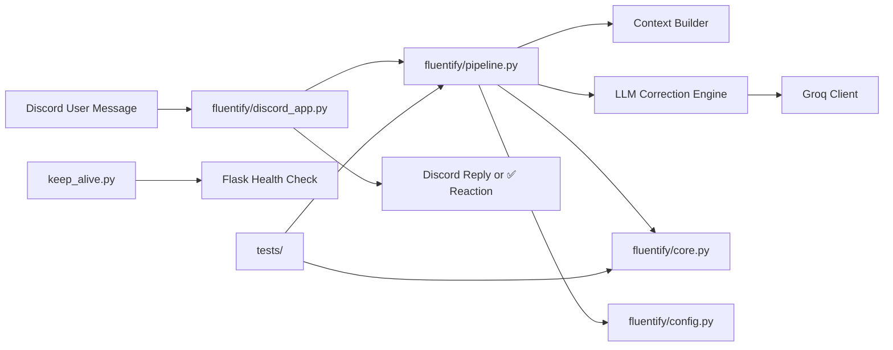
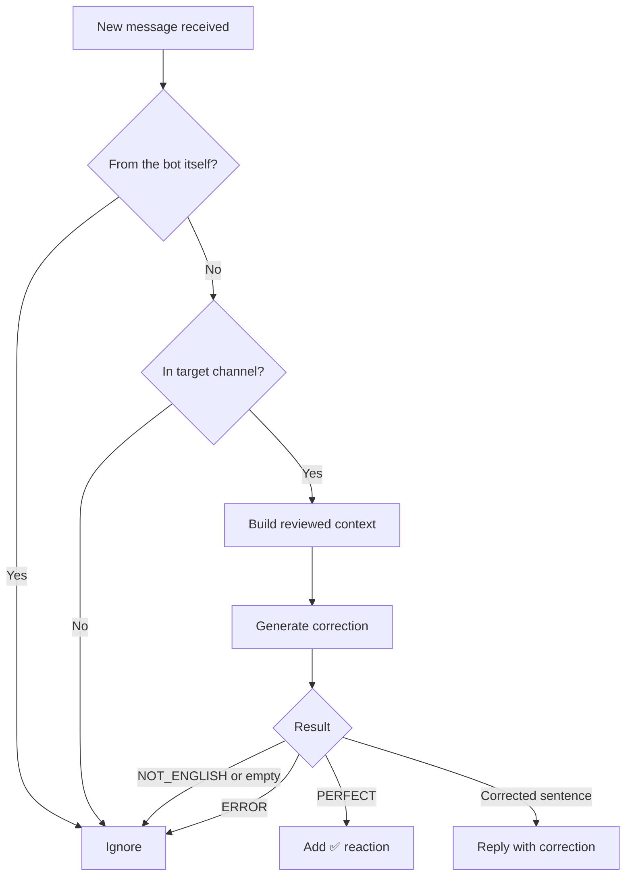

# Fluentify Bot

<p align="center">
  
  
  
  
  
</p>

A Discord bot that reviews English chat messages and returns minimal, natural-sounding corrections for conversational American English.

Instead of over-correcting every message, Fluentify tries to stay quiet when a sentence is already good. If the input is natural enough, it reacts with a ✅. If the input needs improvement, it replies with a corrected version.

## Highlights

- Minimal-intervention correction style for natural chat English
- Discord-native workflow with reactions for already-good messages
- Context-aware message review using previously reviewed conversation history
- Fallback LLM strategy for better resilience under timeout or rate-limit issues
- Automated tests for rules, regressions, and pipeline behavior
- Lightweight health-check server for simple deployment setups

## Tech Stack

<p>
  
  
  
  
  
  
  
</p>

## System Architecture



## Message Review Flow



## How It Works

1. A user sends a message in the configured Discord channel.
2. The bot ignores its own messages and anything outside the target channel.
3. The pipeline collects compact reviewed context from recent messages:
   - messages approved by the bot with ✅
   - messages previously corrected by the bot
4. The current sentence and context are sent to the LLM with instructions to preserve meaning, speaker, and sentence type.
5. The final result is handled like this:
   - `PERFECT` → add ✅ reaction
   - `ERROR` or empty output → do nothing
   - corrected sentence → reply to the original message

## Project Structure

```text
fluentify-bot/
├── main.py                 # Starts the health-check thread and Discord bot
├── keep_alive.py           # Flask app for uptime / health checks
├── .env.default            # Example environment variables
├── requirements.in         # Runtime dependency input
├── requirements.txt        # Pinned runtime dependencies
├── dev-requirements.in     # Development dependency input
├── dev-requirements.txt    # Pinned development dependencies
├── pytest.ini              # Pytest configuration
├── fluentify/
│   ├── config.py           # Env loading, model settings, limits, fallbacks
│   ├── core.py             # Text normalization and output sanitization utilities
│   ├── discord_app.py      # Discord client and event handlers
│   └── pipeline.py         # Context building, LLM calls, correction pipeline
└── tests/
    ├── conftest.py         # Test fixtures and helpers
    ├── test_core_rules.py  # Rule and normalization tests
    ├── test_pipeline.py    # Context and message-processing tests
    └── test_regressions.py # Regression tests for edge cases
```

## Requirements

Before running the bot, make sure you have:

- Python 3.11 or newer
- A Discord bot token
- A Groq API key

## Environment Variables

Copy `.env.default` to `.env` and fill in your real credentials:

```env
DISCORD_BOT_TOKEN=<YOUR_DISCORD_BOT_TOKEN>
LLM_API_KEY=<YOUR_LLM_API_KEY>
LLM_API_URL=https://api.groq.com/openai/v1
```

### Variables currently used by the code

- `DISCORD_BOT_TOKEN`
- `LLM_API_KEY`

`LLM_API_URL` appears in the example file, but the current code does not actively use it.

## Installation

```bash
git clone <your-repository-url>
cd fluentify-bot
python -m venv .venv
source .venv/bin/activate  # On Windows: .venv\Scripts\activate
pip install -r requirements.txt
```

Then create your `.env` file:

```bash
cp .env.default .env
```

## Run

```bash
python main.py
```

On startup:

- Flask starts a small web server on port `8000`
- the Discord client logs in with your bot token
- the bot begins listening for messages in the configured channel

Expected console output:

```text
✅ Logged in as: <your bot user>
Fluentify is now running!
```

## Channel Scope

The bot currently operates only in the Discord channel named:

```text
english-chat
```

This is controlled by `TARGET_CHANNEL_NAME` in `fluentify/config.py`.

## Runtime Configuration

The current code includes these built-in controls:

- Temperature: `0.2`
- Timeout per LLM call: `12` seconds
- Max context length: `1200` characters
- Max stored history message length: `220` characters
- Max reviewed history messages: `5`
- LLM concurrency limit: `3`

It also attempts multiple fallback models in sequence when a timeout, rate limit, or other API issue occurs.

## Testing

Install development dependencies:

```bash
pip install -r dev-requirements.txt
```

Run the test suite:

```bash
pytest
```

The tests cover:

- normalization and sanitization helpers
- reviewed-history context assembly
- message approval and reply-correction behavior
- timeout and rate-limit fallback behavior
- regressions to reduce over-correction

## Deployment Notes

This project includes a lightweight Flask server in `keep_alive.py` so platforms such as Koyeb can perform health checks.

- Health endpoint: `/`
- Default port: `8000`
- Response text: `Fluentify Bot is Alive!`

## Notes and Caveats

- The bot listens in one hard-coded channel: `english-chat`.
- `spacy` is imported in `fluentify/config.py`, but it does not appear in `requirements.txt` and does not appear to be used elsewhere.
- `LLM_API_URL` exists in `.env.default`, but it is not currently wired into client initialization.
- Context is intentionally compact to reduce token usage and latency.

## Future Improvements

- Make the target channel configurable via environment variables
- Support slash commands or per-server configuration
- Add structured logging and correction metrics
- Improve multi-user context handling further
- Make provider and model selection configurable
- Add Docker support for simpler deployment

---

This README is designed to help new contributors understand the project quickly, run it locally, and see the core message-processing flow at a glance.
